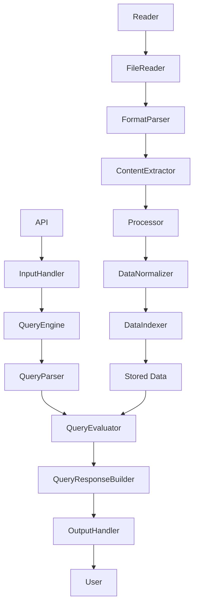

# Infovore

Infovore is an open-source service that can read nearly any data and document format (structured or unstructured) and answer queries about the data in that document. It is designed to be extensible and easy to integrate with various data sources and formats.




## Main Components

1. **Reader**: Reads and parses different data/document formats
2. **Processor**: Processes and structures the parsed data
3. **QueryEngine**: Answers queries using the structured data
4. **API**: Handles user input and output

## Getting Started

These instructions will help you set up and run the Infovore project on your local machine for development and testing purposes.

### Prerequisites

* Python 3.x
* Required Python packages (listed in `requirements.txt`)

### Installation

1. Clone the Infovore repository:

```
git clone https://github.com/yourusername/infovore.git
```

2. Change to the project directory:

```
cd infovore
```

3. Create a virtual environment and activate it:

```
python3 -m venv venv
source venv/bin/activate
```

4. Install the required Python packages:

```
pip install -r requirements.txt
```

5. Run the project:

```
python main.py
```

## Contributing

Please read `CONTRIBUTING.md` for details on our code of conduct and the process for submitting pull requests to us.

## License

This project is licensed under the MIT License - see the `LICENSE.md` file for details.

## Acknowledgments

* Thanks to all the open-source libraries used in this project
* Special thanks to the community for their support and contributions
